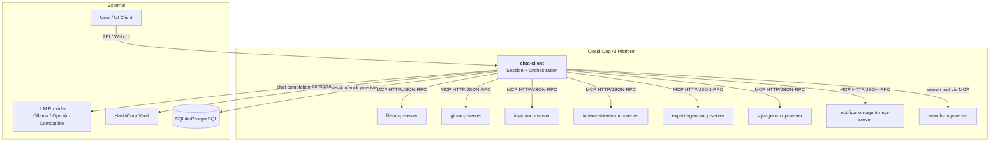
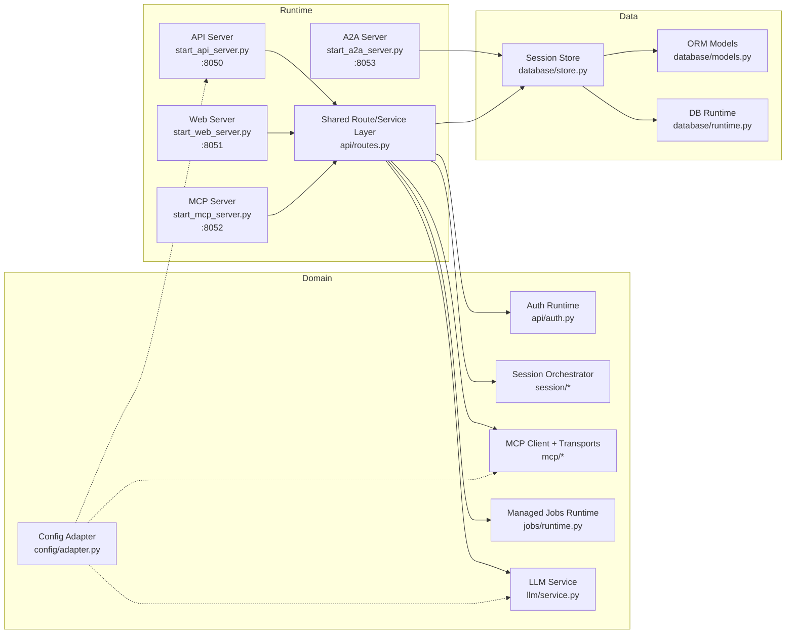
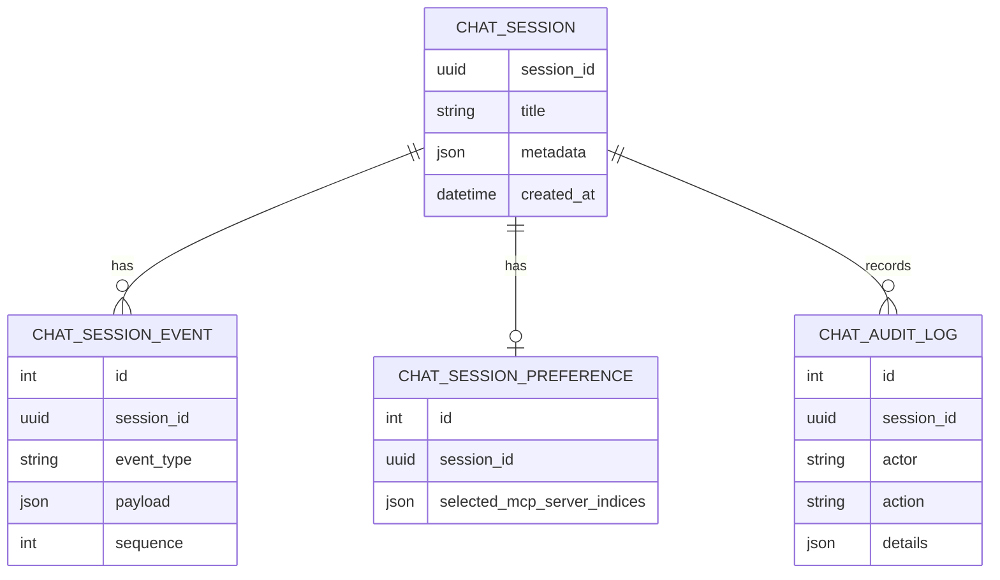
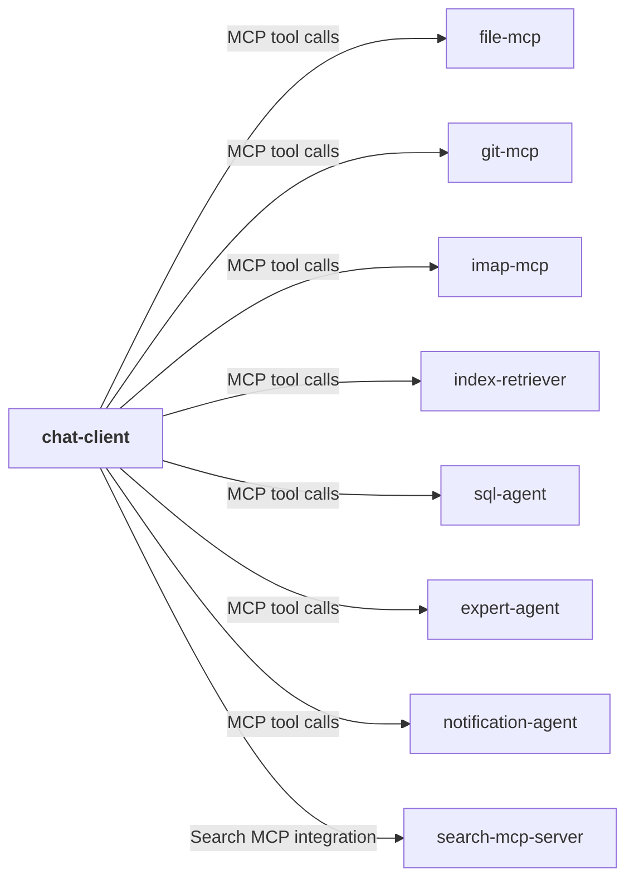
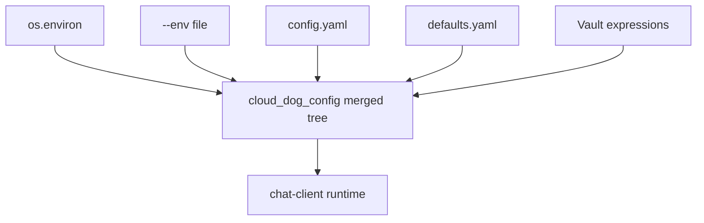
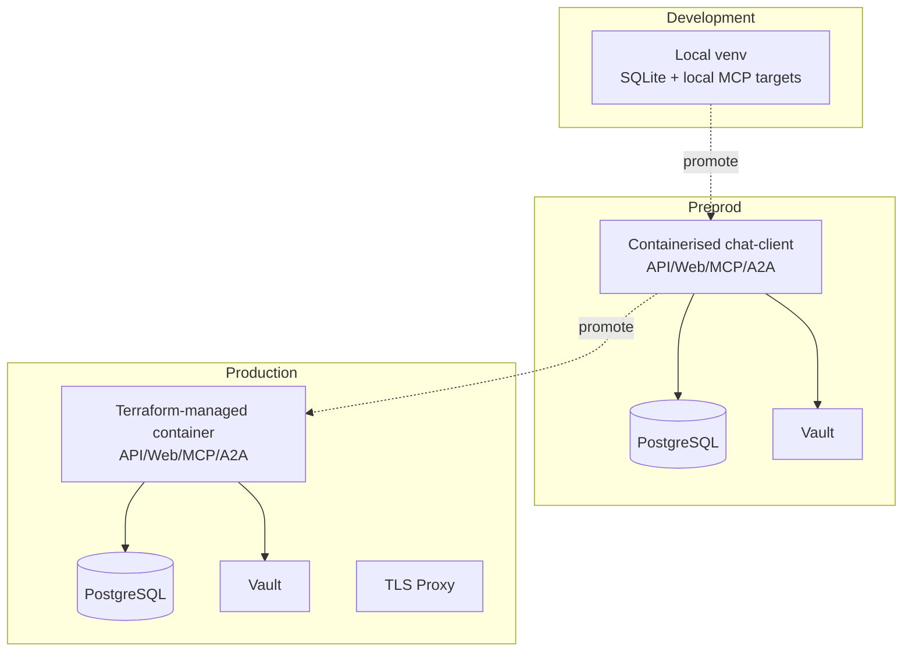
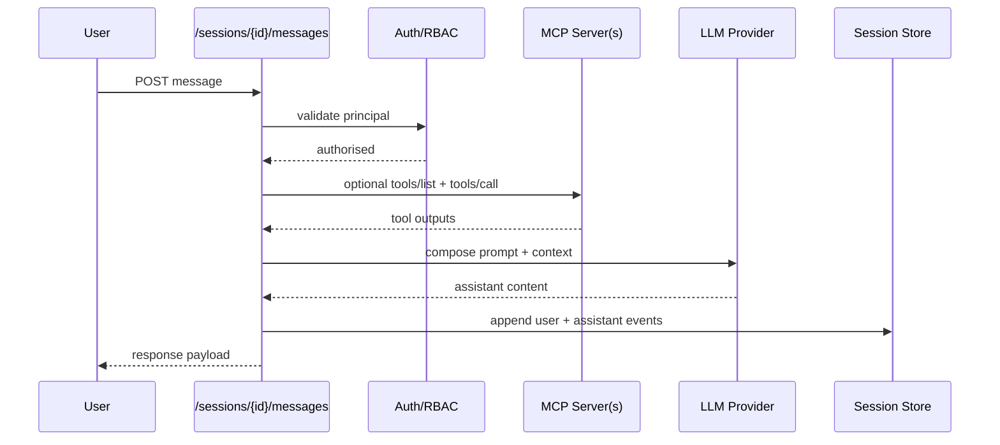
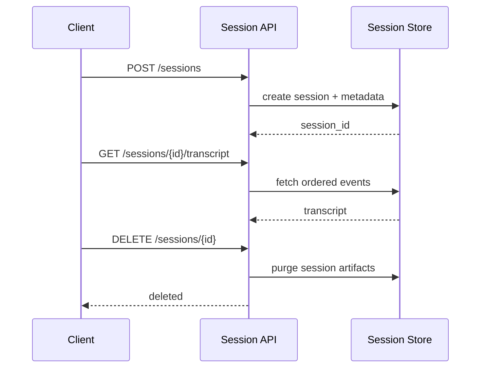

# Chat Client — Architecture

## Document Status

This is the canonical architecture file for chat-client. API details,
identity/use-case traceability, data model, and test proof are split into
`API-REFERENCE.md`, `ROLES-AND-USECASES.md`, `DATA-MODEL.md`, and `TESTS.md`.

## 1. Overview
`chat-client` is the user-facing orchestration service for Cloud-Dog AI. It provides a split 4-server runtime for REST API, Web UI, MCP exposure, and A2A event fanout, alongside session lifecycle management, conversation persistence, and orchestration of external MCP servers and LLM providers.

The service does not implement domain tools directly. Instead, it brokers requests to configured MCP services (for example file, git, IMAP, search, index-retriever, expert, SQL) and combines MCP outputs with LLM responses to deliver end-to-end workflows.

Architecturally, `chat-client` is a control-plane and interaction-layer component: it standardises authentication, configuration, observability, and transcript/audit behaviour while delegating specialist operations to downstream services.

## 2. System Context Diagram

`chat-client` sits between user channels and the wider MCP ecosystem. It owns session context, policy, auth checks, and response formatting while delegating specialist execution to other platform services.

## 3. Component Architecture

The runtime is split into 4 dedicated entrypoints that share the same configuration, persistence, and orchestration layer:

| Server | Entry point | Port | Primary responsibility |
|---|---|---:|---|
| API | `start_api_server.py` | 8050 | REST API, session/message/config CRUD, health/readiness |
| Web | `start_web_server.py` | 8051 | `/login`, `/ui`, admin/config pages, proxy to API |
| MCP | `start_mcp_server.py` | 8052 | Expose chat-client tools as MCP methods |
| A2A | `start_a2a_server.py` | 8053 | Polling/WebSocket event fanout for sessions/config |

Domain components coordinate message flow, MCP execution, and LLM calls. The data layer persists sessions, events, and preferences through `cloud_dog_db`.

## 4. Module Decomposition
| Module | Path | Responsibility | Platform Package |
|---|---|---|---|
| API bootstrap | `src/cloud_dog_chat_client/servers/api_server.py` | API runtime bootstrap and server binding | `cloud_dog_api_kit` |
| Web bootstrap | `src/cloud_dog_chat_client/servers/web_server.py` | Web runtime bootstrap and proxy timeout policy | `cloud_dog_api_kit` |
| MCP bootstrap | `src/cloud_dog_chat_client/servers/mcp_server.py` | MCP runtime bootstrap and tool exposure | `cloud_dog_api_kit` |
| A2A bootstrap | `src/cloud_dog_chat_client/servers/a2a_server.py` | A2A runtime bootstrap and event fanout | `cloud_dog_api_kit` |
| API routes | `src/cloud_dog_chat_client/api/routes.py` | Session, MCP orchestration, transcript, health, UI routes | `cloud_dog_api_kit` |
| Auth integration | `src/cloud_dog_chat_client/api/auth.py` | API key/JWT provider selection, RBAC checks | `cloud_dog_idam` |
| MCP client | `src/cloud_dog_chat_client/mcp/` | Server config parsing, transport clients, conformance checks | — |
| LLM orchestration | `src/cloud_dog_chat_client/llm/` | Provider selection, request/response normalisation | `cloud_dog_llm` |
| Jobs runtime | `src/cloud_dog_chat_client/jobs/runtime.py` | Managed job registration and status for MCP proxy calls | `cloud_dog_jobs` |
| Configuration | `src/cloud_dog_chat_client/config/adapter.py` | Layered config loading and coercion | `cloud_dog_config` |
| DB runtime | `src/cloud_dog_chat_client/database/runtime.py` | Engine/session initialisation, migration execution | `cloud_dog_db` |
| Session persistence | `src/cloud_dog_chat_client/database/store.py` | CRUD for sessions/events/preferences | `cloud_dog_db` |
| ORM models | `src/cloud_dog_chat_client/database/models.py` | Chat persistence schema | SQLAlchemy |
| Logging | `src/cloud_dog_chat_client/utils/logger.py` | Structured logging setup | `cloud_dog_logging` |

## 5. Data Model

The persistence model is session-centric: messages and tool actions are appended as ordered events, with independent preference and audit records.

## 6. Interface Specifications
### 6.1 REST API
| Method | Path | Description | Auth |
|---|---|---|---|
| GET | `/health` | Liveness and runtime metadata | None |
| GET | `/ready` | Readiness check | None |
| POST | `/sessions` | Create chat session | API key / JWT |
| GET | `/sessions` | List sessions | API key / JWT |
| DELETE | `/sessions/{session_id}` | Delete session | API key / JWT |
| POST | `/sessions/{session_id}/messages` | Send chat message | API key / JWT |
| GET | `/sessions/{session_id}/transcript` | Retrieve transcript | API key / JWT |
| POST | `/sessions/{session_id}/mcp/tools/call` | Invoke MCP tool | API key / JWT |
| POST | `/sessions/{session_id}/mcp/execute` | Batch MCP JSON-RPC execution | API key / JWT |

REST API surface is served from the dedicated API server on port `8050`.

### 6.2 Web Server
| Method | Path | Description | Auth |
|---|---|---|---|
| GET | `/health` | Web runtime health | None |
| GET | `/login` | HTML login page | Session/API key bootstrap |
| GET | `/ui` | HTML chat UI | Session/API key bootstrap |
| GET | `/ui/config` | UI runtime config payload | API key / JWT |
| GET | `/ui/config/tree` | Redacted config tree for operators | API key / JWT |

### 6.3 MCP Server
The dedicated MCP server on port `8052` exposes `chat-client` as an MCP-capable service. It supports:
- `initialise`
- `tools/list`
- `tools/call`

Current tool catalogue includes:
- `create_session`
- `send_message`
- `list_sessions`
- `get_history`

`chat-client` also remains an MCP **consumer/orchestrator** through its REST APIs and supports:
- tool listing (`tools/list`) against configured server index or inline server object
- tool invocation (`tools/call`) via dedicated route and execute-batch path
- execution batches through `/mcp/execute`

### 6.4 A2A Endpoints
The dedicated A2A server on port `8053` exposes:
- `GET /health`
- `GET /a2a/health`
- `GET /a2a/events` for polling persisted session/config change events
- `GET /a2a/ws` for WebSocket fanout across `sessions`, `messages`, and `config` topics

This is intentionally narrow: it broadcasts persisted chat-session and config-change events rather than acting as a generic cross-project A2A broker.

## 7. Dependencies & External Services
### 7.1 Platform Packages
| Package | Usage in this project |
|---|---|
| `cloud_dog_config` | Layered config loading and env/Vault resolution |
| `cloud_dog_logging` | Structured logging and audit helpers |
| `cloud_dog_api_kit` | FastAPI app factory and middleware integration |
| `cloud_dog_idam` | Auth provider and RBAC enforcement |
| `cloud_dog_llm` | Provider adapters and request models |
| `cloud_dog_db` | DB runtime, models, migrations |
| `cloud_dog_jobs` | Managed job registration and status for long-running MCP proxy operations |
| `cloud_dog_storage` | Storage abstraction dependency kept available for file-transfer/profile integration points |

### 7.2 External Services
| Service | Purpose | Connection | Vault Path |
|---|---|---|---|
| Vault | Secrets/config | `VAULT_ADDR` + token | `secret/config` |
| LLM provider | Chat generation | `llm.base_url` | `dev.models.*` |
| SQLite/PostgreSQL | Session persistence | `db.*` / URL | `dev.databases.*` |
| MCP servers | Tool execution | per-server base URL | `dev.services.*` / env config |

### 7.3 Cross-Project Dependencies

## 8. Configuration Architecture

Primary configuration domains are `app`, `log`, `client_api`, `api_server`, `web_server`, `mcp_server`, `a2a_server`, `mcp`, `llm`, `db`, and `chat_tests`. Secrets are resolved via Vault expressions and never hardcoded in tracked files.

Managed job configuration lives under `jobs.*`. Chat-client currently uses the `cloud_dog_jobs` memory backend to track long-running MCP proxy operations and expose them through `/api/v1/jobs`.

## 9. Security Architecture
- Authentication: API key and JWT-compatible auth providers through `cloud_dog_idam` integration.
- Authorisation: RBAC checks applied to route handlers and admin-only operations.
- Secrets: Vault-backed resolution through `cloud_dog_config`; sensitive values are not logged.
- Audit: chat and tool activity persisted and emitted via structured audit logging.
- Network: HTTP APIs with configurable host/port/TLS settings and MCP transport timeout controls.

## 10. Deployment Architecture

## 11. Key Flows
### 11.1 Message Processing with MCP-Augmented Context

### 11.2 Session Lifecycle

## 12. Non-Functional Characteristics
| Characteristic | Approach |
|---|---|
| Scalability | Stateless API workers with external MCP service fan-out |
| Reliability | Timeout controls for LLM/MCP, explicit error mapping, retry-safe APIs |
| Observability | Structured logs, request IDs, session event trails, health/ready/live endpoints |
| Performance | Async HTTP clients for MCP and LLM operations, bounded output reducers |
| Maintainability | Clear module split (`api`, `mcp`, `llm`, `database`, `config`) and platform package reuse |

## 13. Operational Insights (Promoted from `working/`)
- MCP integration reliability is dominated by external dependency readiness and auth correctness; chat-client is designed to fail fast with explicit `502`/`403` upstream error propagation rather than masking failures.
- API auth and RBAC behaviour are intentionally split between user and admin key headers; runtime server mutation routes (`/mcp/servers*`) are admin-gated.
- UI/runtime operability depends on accurate backend endpoint wiring and timeout configuration (`client_api.ui_wait_timeout_seconds`, MCP per-server timeouts).
- Database startup follows platform abstraction (`cloud_dog_db`) so runtime health and migration status are surfaced in `/health` and `/ready` checks.
